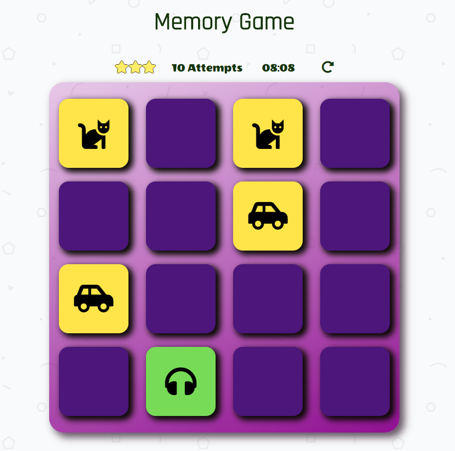

# Memory Game

## Overview
The Memory Game is a complete browser-based card matching game.

## How to start
1. Clone this repository or download and place zip file.
2. open the html file

## Instructions
* Click on a card
* Keep revealing cards and working your memory to remember each unveiled card.
* Match cards properly with less moves as sson as possible.

## How to build the Memory Game
By manipulating the DOM and combining HTML, CSS, and JavaScrip.
* created a deck of cards that shuffles when page/game is reset.
* created a counter counting the number of attempts made by player and
  a timer to know the duration of a playthrough
* added CSS for styling purposes.
* created a pop-up modal when the game is finished.
